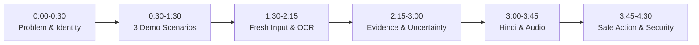

# SCAMSHIELD BHARAT — FINAL DEMO VIDEO CHECKLIST

**Target Duration:** 3–5 Minutes  
**Platform:** [https://scamshield-bharat-kappa.vercel.app/](https://scamshield-bharat-kappa.vercel.app/)  
**Presentation Deck:** [`presentation/index.html`](file:///c:/Users/dell/Desktop/IIT%20BHU/presentation/index.html)

---

## ⏱️ Timed 3–5 Minute Presentation & Demo Script

---

### [0:00 – 0:30] 1. The Ground Reality & Product Identity
- **Screen:** Homepage hero on `https://scamshield-bharat-kappa.vercel.app/`
- **Key Talking Points:**
  - Introduce **ScamShield Bharat** (*"Check the claim before you act"*).
  - Indian retail investors face aggressive cyber fraud: WhatsApp guaranteed return tips, fake KYC SMS, and remote-access APKs.
  - ScamShield Bharat is **NOT** a stock picker, generic chatbot, or investment advisor. It is an **evidence-first pre-action safety layer**.

---

### [0:30 – 1:30] 2. The 3 Deterministic Demo Scenarios
- **Screen:** Click each of the 3 quick-load buttons on the homepage:
  1. **Scenario A (Guaranteed Return Scam):**
     - Click *"Guaranteed 30% monthly returns in VIP Telegram group"*.
     - Point out immediate `HIGH CONCERN` badge.
     - Show extracted claims (30% monthly profit, SEBI approved, ₹50,000 upfront deposit).
     - Show risk signals: `GUARANTEED_RETURN`, `TELEGRAM_REDIRECT`, `REGULATORY_CLAIM`.
  2. **Scenario B (Fake KYC Expiry Threat):**
     - Click *"Urgent: KYC expires tonight, trading account blocked"*.
     - Show risk signals: `FAKE_KYC_CLAIM`, `URGENCY`, `FEAR_THREAT`, `SUSPICIOUS_DOMAIN`.
  3. **Scenario C (Remote Access APK):**
     - Click *"Install remote support APK to verify trading account"*.
     - Show risk signals: `REMOTE_ACCESS`, `APK_INSTALLATION`, `IMPERSONATION`.

---

### [1:30 – 2:15] 3. Fresh Non-Canned Message & Screenshot/OCR Verification
- **Screen:** Paste a new, non-canned message or upload a test screenshot.
- **Key Talking Points:**
  - Show that the system is fully dynamic, evaluating user-supplied text or screenshots on the fly.
  - Demonstrate automatic in-memory PII masking (+91 phone numbers, PAN cards, OTPs masked before evaluation).
  - Show magic byte validation preventing malicious non-image file uploads.

---

### [2:15 – 3:00] 4. Official Evidence Grounding & Transparent Uncertainty
- **Screen:** Scroll to the **Evidence Trail & Official Circulars** section.
- **Key Talking Points:**
  - Every detected risk signal links directly to official regulatory guidance:
    - **SEBI Recognised Intermediaries** (license verification).
    - **SEBI Spot a Scam Advisory** (prohibited guaranteed returns).
    - **SEBI SCORES 2.0** (grievance redressal against registered entities).
    - **CERT-In Alerts** (malicious APK sideloading).
    - **RBI Sachet Portal** (unauthorized deposit schemes).
  - Highlight **Epistemic Honesty**: Unverified claims are marked as *"Could not verify independently"* rather than making false binary claims.

---

### [3:00 – 3:45] 5. Bharat-First Accessibility (Hindi & Speech Audio)
- **Screen:** Toggle **`हिंदी`** mode and click **`🔊 सुनें` (Listen)**.
- **Key Talking Points:**
  - Show the entire briefing, risk signals, claims, and action checklist rendered in clean Devanagari Hindi.
  - Trigger the on-device voice reader (`window.speechSynthesis`) to show accessibility for senior citizens and low-literacy users.

---

### [3:45 – 4:30] 6. Safe 5-Step Action Rail & Security Architecture
- **Screen:** Scroll to **Safe Next Steps** and footer.
- **Key Talking Points:**
  - Explain the 5-step calm action rail: **STOP** $\to$ **PROTECT** $\to$ **VERIFY** $\to$ **REPORT (Helpline 1930 / cybercrime.gov.in)** $\to$ **RECOVER**.
  - Summarize security-by-design:
    - Zero data retention (ephemeral processing).
    - Rate-limited (30 req/min/IP).
    - SSRF protection against cloud metadata and private IP ranges.
    - Strict non-advisory boundary with RIA directory referral.
- **Closing:** Conclude with the mission: Empowering everyday Indian investors to stop, verify, and protect their money.

---

## 📋 Pre-Recording Verification Checklist

- [x] Microphone and screen recording software tested (1080p, clear audio).
- [x] Live URL open in fresh browser window: `https://scamshield-bharat-kappa.vercel.app/`.
- [x] Audio output enabled for Speech Synthesis test (`🔊 Listen`).
- [x] Test screenshot file ready for OCR upload demonstration.
- [x] Timing rehearsed to stay strictly within 3:00–4:30 minutes.
